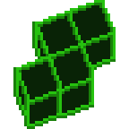
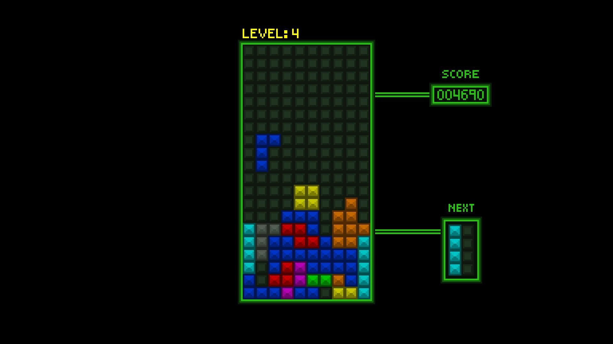

# Tetris 

Just a minimalistic Tetris game. Also my course work (*v1.0.3a*).

> [!NOTE]
> This project **is not** targeted as original implementation of the Tetris game!

## Controls

- A,D - rotate piece left, right
- ←, →, ↓ - move piece left, right, down
- P - pause

# Contributors

Spacial thanks to @Lemonade557 for design and drawn assets! 
